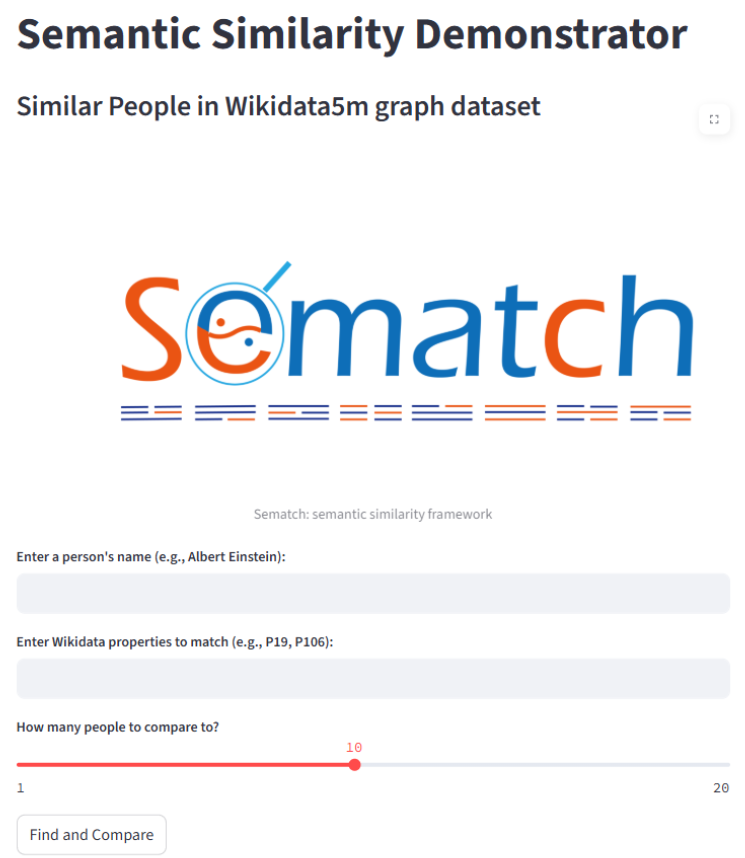
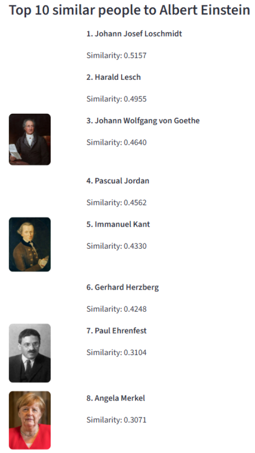

# Semantic Similarity Demonstrator

## Introduction

The project presents a **web-based demonstrator** for computing **semantic similarity** between notable
**individuals** using **shared properties** such as place of birth, occupation, and nationality. The
application leverages **semantic web technologies** , including **RDF** data in **GraphDB** , **Wikidata**
property mappings, and semantic similarity metrics implemented in **Sematch** using **DBpedia URIs**.

**Sematch** is an integrated framework for the development, evaluation, and application of semantic
similarity for knowledge graphs. It is easy to use **Sematch** to compute **semantic similarity scores** of
concepts, words and entities. **Sematch** focuses on specific knowledge-based semantic similarity
metrics that rely on structural knowledge in taxonomy (e.g. depth, path length, least common
subsumer), and statistical information contents (corpus-IC and graph-IC).

<p align="center"></p>

**Two methods** to measure similarity are provided in **Sematch**. Both of them rely on **DBpedia URIs**.
The first one is **entity similarity**. It means how much two entities are alike in meaning. Similarity
focuses on shared categories, functions, or roles. High similarity usually means they belong to the
same type or class. The other metric is **entity relatedness**. It means how much two entities are
connected or associated in some way. Related entities may be connected, but not similar in type. We
can think of **relatedness** as a broader concept than **similarity**.

## Technology Stack

- **Python 3.11** – programming logic and scripts
- **Sematch** – compute semantic similarity between people using DBpedia URIs
- **PyCharm** – IDE for creating the scripts and running the Python environment
- **GraphDB** – store and query RDF triples (human-related subset of Wikidata5M)
- **SPARQLWrapper** – library to execute SPARQL queries on GraphDB
- **Wikidata API** – resolve human-readable labels to Q-IDs
- **DBpedia** – obtain semantic URIs and images of individuals

## Dataset

The dataset for this project assignment is **Wikidata5m**. It is a million-scale knowledge graph dataset
with aligned corpus. This dataset integrates the **Wikidata** knowledge graph and **Wikipedia** pages.
Each entity in **Wikidata5m** is described by a corresponding **Wikipedia** page, which enables the
evaluation of link prediction over unseen entities.

## Project Steps

### 1. Download the data

- Wikidata5m transductive split 160 MB
- Data Sample:

```
Q29387131 P31 Q5
Q326660 P1412 Q652
Q7339549 P57 Q1365729
Q554335 P27 Q29999
Q20641639 P54 Q80955
Q14946683 P31 Q5
Q4221140 P27 Q399
```

### 2. Topic selection and extract of the subgraph

The topic of the project depends on the content of the data. The first idea that I thought of was to
compare **similar towns and cities**. However, after analysis of the **Wikidata5m** dataset, I saw that
some key properties related to the location of the populated place and their type are missing. That is
why I turned to my second idea which was to compare **similar people**. This topic is broader enough
and I was sure that there was enough data for that purpose.

To limit the scope of the semantic similarity analysis to human entities, a subgraph was extracted
from the large **Wikidata5m** dataset using the **extract_human_subgraph.py** script. The original dataset
(**wikidata5m_transductive_train.txt**) consists of millions of triples in the format:

```
<subject> <predicate> <object>
```

This script filters the dataset to retain only those triples where the subject represents a human. In
**Wikidata** , all humans are identified as instances of the class **Q5**. The property that connects an entity
to its class is **P31** (“instance of”).

The script operates in two phases:
**2.1 Identifying Human entities**

```python
if predicate == "P31" and object == "Q5":
    human_entities.add(subject)
```
The script reads the entire file once to collect all subjects that are marked as instances of people
(P31 → Q5). These subject IDs are stored in a set called **human_entities** for efficient lookup.

**2.2 Filtering the Triples**

```python
if subject in human_entities:
    fout.write(line)
```
A second pass over the dataset writes only those triples to a new file
( **wikidata5m_human_subgraph.txt** ) where the subject is one of the identified human entities. This step
ensures that the resulting file contains all triples about humans, including their properties,
relationships, and connections.

### 3. Convert to RDF Turtle format

After extracting a subgraph of human-related triples from the original **Wikidata5m** dataset, the next
step is to convert the plain-text triple format into the **Turtle (TTL) format** , which is a widely-used
**RDF** serialization standard supported by graph databases like **GraphDB**. The script
**convert_to_turtle_format.py** transforms the tab-separated triples in
**wikidata5m_human_subgraph.txt** into the **RDF Turtle** format and writes them to a new file:
**wikidata5m_human_subgraph.ttl**.

The helper function **to_uri()** is used to format each component into a full **URI** string based on
whether it is a property or not.

```python
def to_uri(qid, is_property=False):
    if is_property:
        return f"<http://www.wikidata.org/prop/direct/{qid}>"
    else:
        return f"<http://www.wikidata.org/entity/{qid}>"
```

This conversion ensures that the extracted subgraph is semantically compliant with **RDF** standards
and can be used for further semantic similarity operations in tools like **Sematch** and **GraphDB**.

### 4. Enrich human subgraph with labels from Wikidata

After converting the extracted human-related subgraph into **RDF Turtle** format, the next logical step
is to augment the graph with **human-readable labels**. This greatly improves interpretability for
applications like semantic similarity search or visualisation in a semantic web interface. This script
fetches English labels for all entities (**Q-IDs**) used in the **RDF** graph from the official **Wikidata API**
and appends them in **Turtle** format.

The **extract_qids_from_ttl** function scans every line in the **TTL** file for entity identifiers using
regular expressions. All detected **Q-IDs** are stored in a **Python** set to avoid duplicates. Then the script
sends **HTTP GET** requests to the **Wikidata API** using the **wbgetentities** endpoint. Requests are sent
in batches of **BATCH_SIZE = 50** to comply with **API** rate limit and improve performance. If a
request fails, the script automatically retries it up to **MAX_RETRIES** times, with a sleep interval in
between. Finally, each label is written as a new **RDF** triple using the standard **rdfs:label** predicate.

### 5. Create GraphDB repository and load the TTL files

In my local **GraphDB Free Edition** I created a new repository entitled **‘human_similarity’**. I
imported the two **TTL** files in it, one of which using **Server files** method because the size was over
1 GB. The total statements of the repository are 11 361 358.

### 6. Semantic Similarity demonstrator

The **Streamlit** app allows the user to enter a person’s name, enter **Wikidata properties** , retrieve the
**QID** of that person from my local **GraphDB** , use those properties to find other humans from the
**RDF** graph who share the same property values, and for each matching person displays their label
and image together with computing a semantic similarity score using **DBpedia URIs** and **Sematch**.

The webpage with **Streamlit** displays a title and a subtitle introducing the semantic similarity
demonstrator, the logo of **Sematch** , a text input to enter a person’s name, a text input to define
**Wikidata properties** , a slider to select how many results to show, and a button to execute the
matching.

<p align="center"></p>

As soon as a name of a person is typed, **get_image_url_from_dbpedia(label)** is called. It constructs
a **SPARQL** query to **DBpedia** to retrieve the person’s thumbnail or depiction. If an image **URL** is
found, it is displayed centred in the **UI**. The actual logic begins when the button is pressed. The
**get_person_qid_by_label(label)** function searches **GraphDB** using the entered label. If no match
is found, an error is displayed. Next, the script parses the user-specified properties and runs a query
to get the values for those properties for the given **Q-ID**. That is handled by the
**get_property_values(qid, properties)** function.

Using the retrieved **property – value** pairs, the app constructs a filter with which it queries **GraphDB**
to find other humans with the same values. Once candidates are found the app removes the original
person from the list and for each remaining person it constructs their **DBpedia URI** , uses **Sematch**
to compute semantic entity similarity between the defined person and the candidate, and tries to fetch
an image (if there is one) from **DBpedia**. Finally, the rows are sorted by semantic similarity in a
descending order.

## Results

This project demonstrates a **semantic search application** that finds and ranks people similar to a
given individual based on shared **Wikidata properties** (e.g., occupation, birthplace) and **semantic
similarity** using **DBpedia** and **Sematch**.

My initial idea was to use the **Wikidata5m** subgraph as a dataset on which **Sematch** to be adapted.
However, it turned out that this is not possible or at least not well-documented. So it was my
responsibility to think of an idea how to use the subgraph from **Wikidata** when **Sematch** uses only
**DBpedia** concepts and entities. As future work, the **demonstrator** can be extended to other domains
such as similar cities, books, artworks, historical events using the same semantic approach. Moreover,
another dataset can be used, specifically it can be an excerpt from **DBpedia** that is the compatible
instrument of **Sematch**.

<p align="center"></p>
